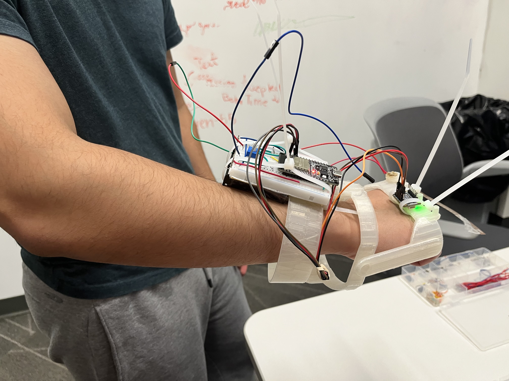
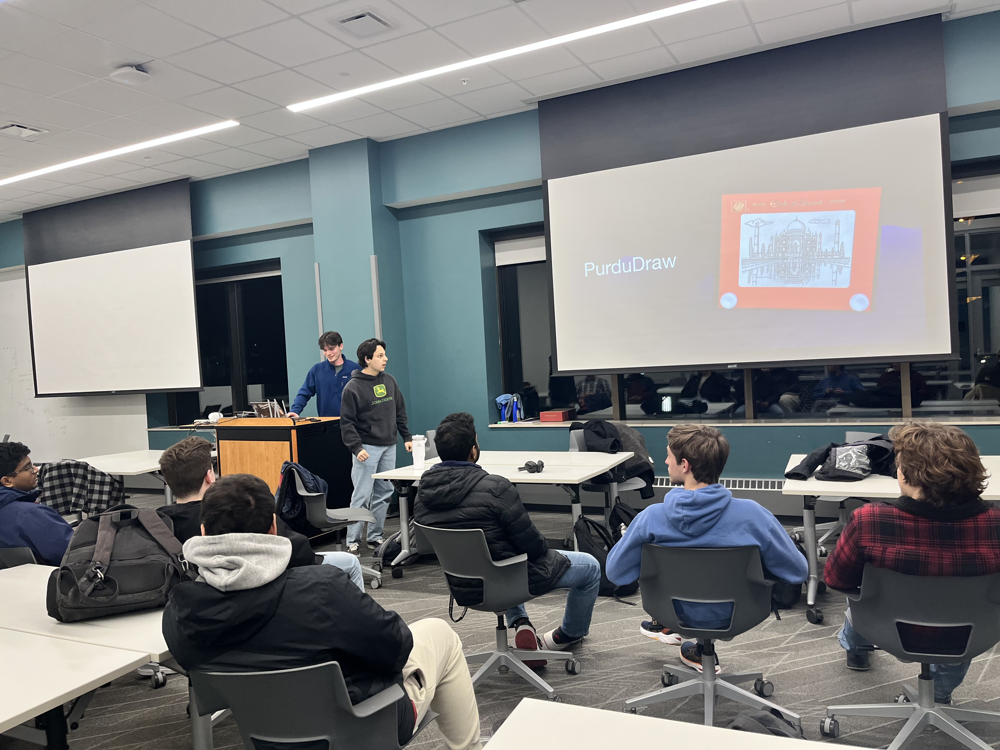
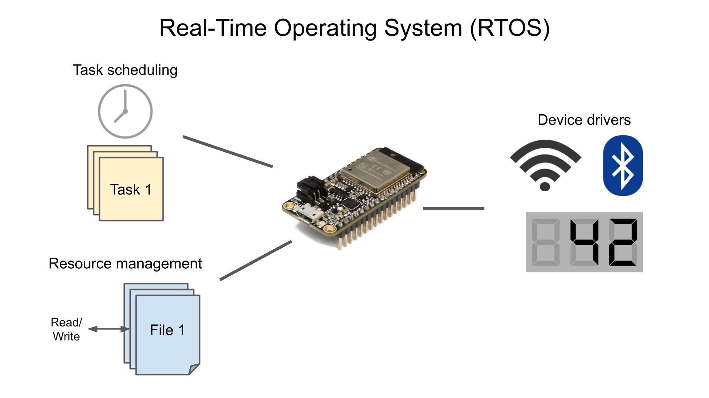

import { Card, CardGrid } from '@astrojs/starlight/components';
import { LinkButton } from '@astrojs/starlight/components';

<CardGrid stagger>
  <Card title="Founded in 2025" icon="rocket">
    Started by a group of Electrical and Computer Engineering juniors, we saw a need for a community of builders interested in integrated hardware and software projects. Read more [about us](about/about).

    

  </Card>

  <Card title="10+ Projects to choose from" icon="laptop">
    With three projects completed in Spring 2025, we are expanding our reach to cover exciting technical projects that will expand your skills. See [past and future projects](projects/projects).  

    
  </Card>
  <Card title="40+ members" icon="star">
    Our vibrant community is growing! We currently have over 40 members, each contributing their skills to a range of embedded systems projects. Join our [Discord](https://discord.gg/EAZpzCr53V) to get involved.

    
  </Card>
  <Card title="8 Workshops planned for 2025-26" icon="information">
    We teach you what you need to excel in projects, interviews, and land internships. Our workshops cover everything from microcontroller programming to PCB design. Check out our [workshop schedule](workshops/workshops).
    
    
  </Card>
</CardGrid>