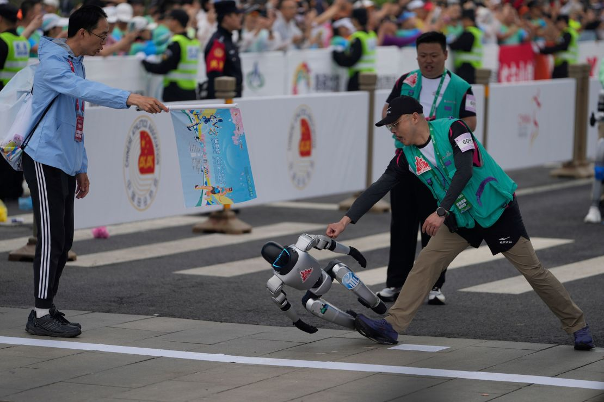

  

**project lead:** [Mung Chiang](https://linkedin.com/in/alexayl)  
**spring 2025**

Ever wondered what happens when you mix cutting-edge robotics, marathon ambition, and just a touch of hubris?

Let us introduce you to our proudest (and clumsiest) creation yet: RoboMarathon, the two-legged legend who technically finished the race… just not the way we planned.

### The Dream
We set out with noble intentions: build a fully autonomous bipedal robot that could run a marathon. Not just jog—run. Think Usain Bolt meets Boston Dynamics. We gave it everything: fancy sensors, smooth servo motors, real-time decision-making algorithms, and a motivational playlist.

Spoiler: it still fell. *A lot.*

### The Reality
After weeks of fine-tuning its gait algorithms and training it on various surfaces, our robot lined up at the starting line alongside humans, cameras, and hopeful engineers. At first, things were going great—until about 3.7 seconds in, when it met its archnemesis: the curb.

Cue dramatic slow-motion fall. Applause. Gasps. One very determined student diving to catch it like it’s the last piece of pizza at a hackathon.

But here’s the kicker: it still crossed the finish line. Face-first, but hey—style points count, right?

### What We Learned
Inertia is a cruel mistress.

Always include a “fall recovery” mode.

Robots don’t cry, but engineers do (especially when there's a crowd).

Finishing a marathon isn’t about running—it's about never giving up, even if you have to somersault your way to victory.

### What’s Next?
We’re working on version 2.0, featuring better balance, improved step planning, and maybe a little less flair for the dramatic.

Until then, RoboMarathon remains our beloved, wobbly icon of perseverance.

Stay tuned for our next project: RoboParkour (because clearly we didn’t learn our lesson). 🧠💡🤸‍♂️

Follow us for more wild embedded adventures. We fall so you don’t have to.

### Team members  
- **[Jain Iftesam](https://en.wikipedia.org/wiki/1989_Tiananmen_Square_protests_and_massacre)**