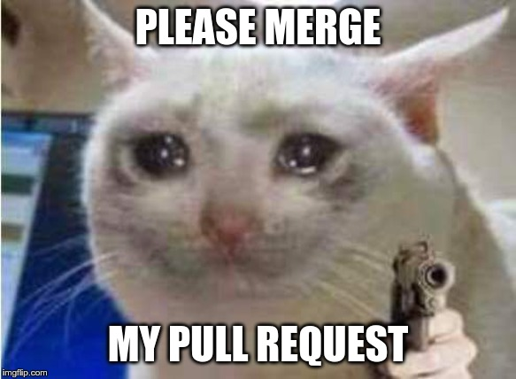

import { Badge } from '@astrojs/starlight/components';

 

<Badge text="Level: Beginner" variant="success" />  <Badge text="Offerred: Fall 2025" variant="note" /> <Badge text="Workshop leader: Alex Aylward" variant="tip" />

 

import { LinkButton } from '@astrojs/starlight/components';

<LinkButton
  href="https://docs.google.com/presentation/d/1Dk7lakdtn65Ym86UzuRHYTsuG3ByWMMBZX1VucDLHyQ/edit?usp=sharing"
  variant="minimal"
  icon="external"
  iconPlacement="start"
>
  Slide deck
</LinkButton>

<LinkButton
  href="https://docs.astro.build"
  variant="minimal"
  icon="external"
  iconPlacement="start"
>
  Workshop recording
</LinkButton>   

<LinkButton
  href="https://docs.google.com/document/d/1m0P8irrmm1R9AWo045FTleryCc791AoaBxEux4LQXEs/edit?usp=sharing"
  variant="minimal"
  icon="external"
  iconPlacement="start"
>
  Git cheat sheet
</LinkButton>

If you save old code in the notes app, with file names like `FinalVersion_FINAL2_REALthisTime.c`, or just raw dog it, this workshop is for you.

## 📚 What you'll learn

- What Git and GitHub are
- How to set up Git on your computer
- Basic Git commands (`add`, `commit`, `push`, `pull`, `clone`)
- How to create and use a GitHub repository
- Collaborating with others (pull requests, branches, forks)
- Best practices for project organization

## 🛠️ What You'll Need

- A GitHub account ([Sign up here](https://github.com/))
- Git installed on your computer ([Install Git](https://git-scm.com/))
- A text editor (we recommend [vs code](https://code.visualstudio.com/), but any text editor will do)

---

## ✏️ Hands-On Exercises

- Create a new repository
- Clone a repo to your local machine
- Make changes and push them to GitHub
- Create a branch and open a pull request
- Resolve a merge conflict (if time allows)

---

## 💡 Pro Tips

- Commit often, commit small
- Write clear commit messages
- Always pull before you push
- Don’t be afraid of merge conflicts — they’re normal!

---

## 📦 Extra Resources

- [GitHub Learning Lab](https://lab.github.com/)
- [Git Handbook (GitHub Docs)](https://docs.github.com/en/get-started/using-git/about-git)
- [Oh Shit, Git!?! (Troubleshooting guide)](https://ohshitgit.com/)

---

# 🚀 Ready to Get Started?

Follow along live during the workshop, or bookmark this page and come back anytime!
